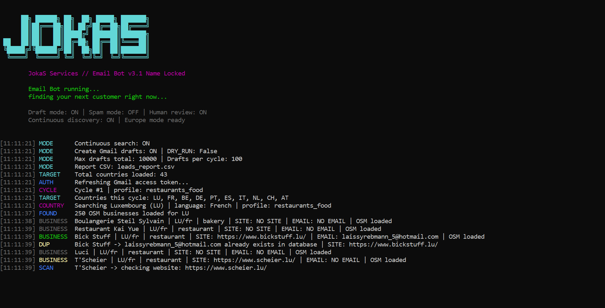
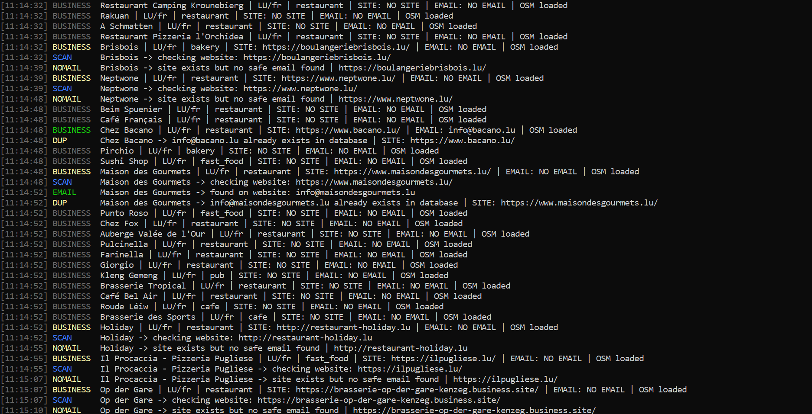
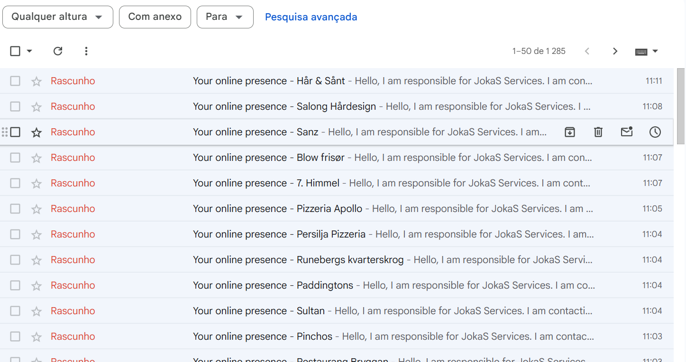
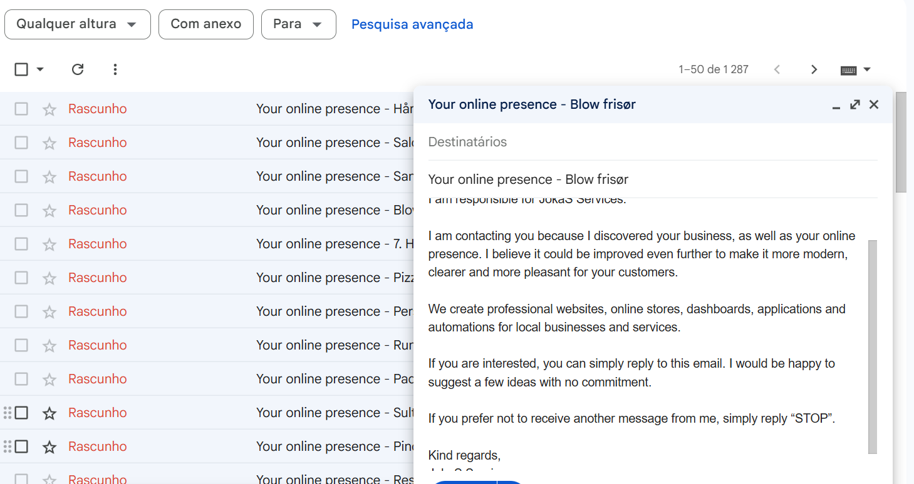
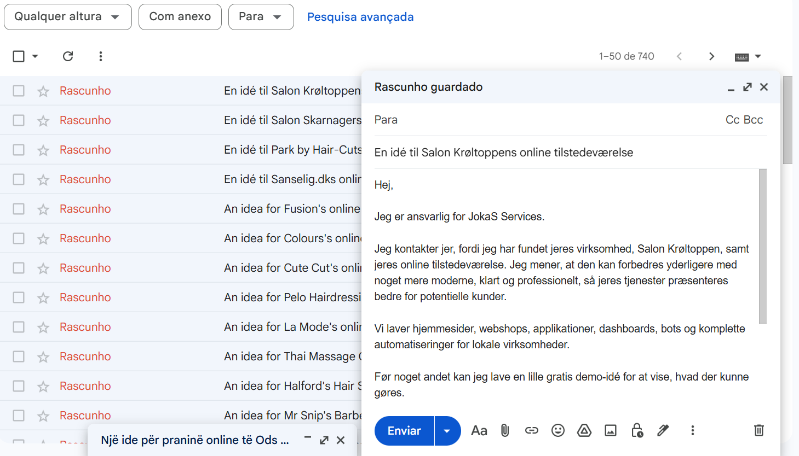
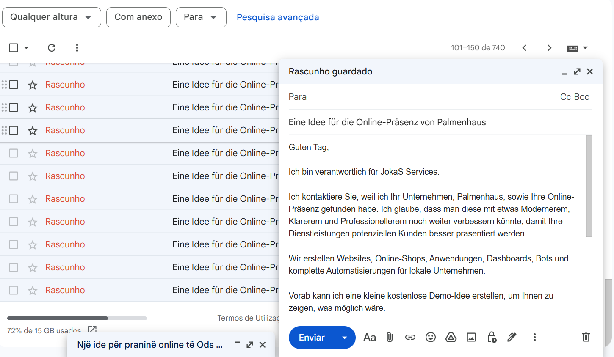
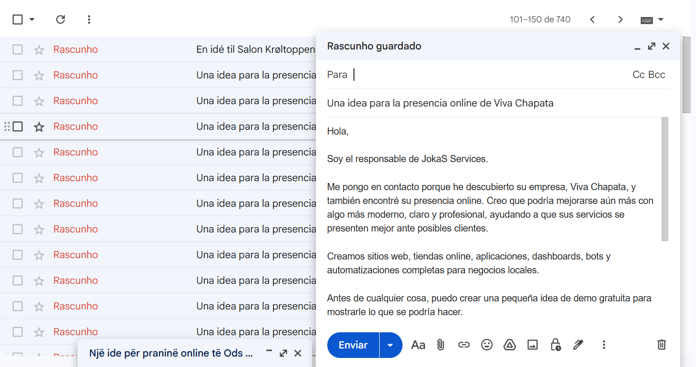

# Email-lead-ai
AI-powered lead research and Gmail draft assistant for local businesses. Finds public business contacts, scans websites, creates multilingual outreach drafts with human review. Built for agencies and small business growth.

# JokaLead AI

**AI-powered lead research and Gmail draft assistant for agencies, freelancers and small businesses.**

JokaLead AI helps agencies and digital service providers discover public business leads, analyze websites, find public contact emails and create professional multilingual Gmail drafts with human review before sending.

Built for local business growth, web design agencies, freelancers, consultants and digital marketing teams.

---

## Overview

JokaLead AI is designed to make lead research and outreach preparation faster, safer and more professional.

The system can search for local businesses by country and niche, check if they have a website, scan public pages for business contact emails and generate ready-to-review Gmail drafts.

It uses AI and local GGUF model support to help create professional outreach messages, adapt the tone and automatically prepare messages in the right language based on the target country.

The goal is not automatic spam sending.
The goal is ethical lead research, draft creation and human-reviewed outreach.

---

## What it does

* Finds local businesses by country and niche
* Detects businesses with or without websites
* Scans public websites for business contact emails
* Extracts public email addresses from business pages
* Creates Gmail drafts instead of sending automatically
* Generates professional outreach messages with AI support
* Automatically adapts the language based on the target country
* Supports multilingual outreach for different markets
* Uses local AI / GGUF model support
* Keeps human review before any email is sent
* Avoids duplicate contacts
* Exports lead reports
* Helps agencies save time when contacting potential clients

---

## Main Features

### Public Lead Research

JokaLead AI can research businesses from different countries and niches, helping agencies discover potential clients in local markets.

### Website Analysis

The tool checks if a business has a website and scans public pages to identify available contact information.

### Public Email Discovery

It searches for public business emails from websites and contact pages while applying safety filters to avoid invalid, unrelated or technical emails.

### AI-Powered Draft Creation

The system prepares professional Gmail drafts that can be reviewed and edited before sending.

### Automatic Country-Based Language Detection

JokaLead AI can automatically choose the outreach language based on the target country.

For example:

* Luxembourg → French
* France → French
* Germany → German
* Netherlands → Dutch
* Portugal → Portuguese
* Spain → Spanish
* Italy → Italian
* United States → English

This makes outreach more natural and professional for each market.

### Local AI / GGUF Support

JokaLead AI supports local GGUF models, allowing AI-powered text generation and translation without relying only on external cloud AI services.

This can help with:

* Email draft generation
* Message translation
* Tone adaptation
* Outreach personalization
* Business-specific wording
* Safe template-based communication

### Gmail Draft Workflow

Instead of sending emails automatically, JokaLead AI creates Gmail drafts.

This allows the user to review every message before sending, keeping full human control over the outreach process.

### Lead Reports

The tool can export lead research results into CSV reports for tracking, organization and follow-up.

---

## Built For

* Web design agencies
* Freelancers
* Digital service providers
* Local business consultants
* Marketing teams
* Small businesses
* Automation builders
* Agencies looking for smarter outreach workflows

---

## Product Preview

### Bot startup in terminal

### Active lead discovery

### Gmail draft preview

### Gmail draft details

### Created Gmail drafts

### Generated email example

### Multilingual outreach draft

---

## Ethical Use

JokaLead AI is designed for ethical lead research and human-reviewed outreach.

It does not promote spam or uncontrolled mass sending.
The system focuses on public business information, safe draft creation and manual review before any message is sent.

Users are responsible for following local laws, privacy rules and email regulations in their country or target market.

---

## Why JokaLead AI?

Finding potential clients manually can take hours.

JokaLead AI helps reduce repetitive research work by combining:

* Public lead discovery
* Website scanning
* Email detection
* AI-powered draft generation
* Automatic language adaptation
* Gmail draft creation
* Human approval workflow

This gives agencies and freelancers more time to focus on real conversations, client work and business growth.

---

## Get Access

JokaLead AI is a commercial tool by **JokaS Services**.

For demos, pricing, custom setup or business inquiries, visit:

**https://jokasservices.gt.tc**

---

## Status

Private and commercial software.

This repository is a public showcase only.
The full source code, private configuration, credentials and internal automation files are not included in this public repository.

